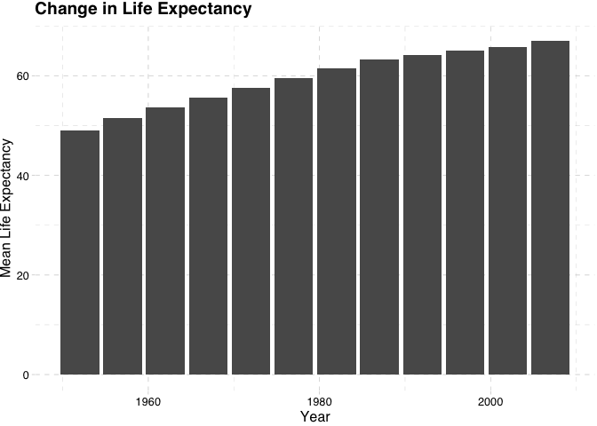
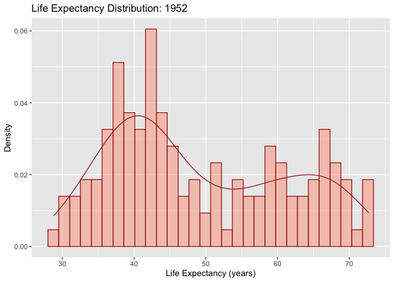
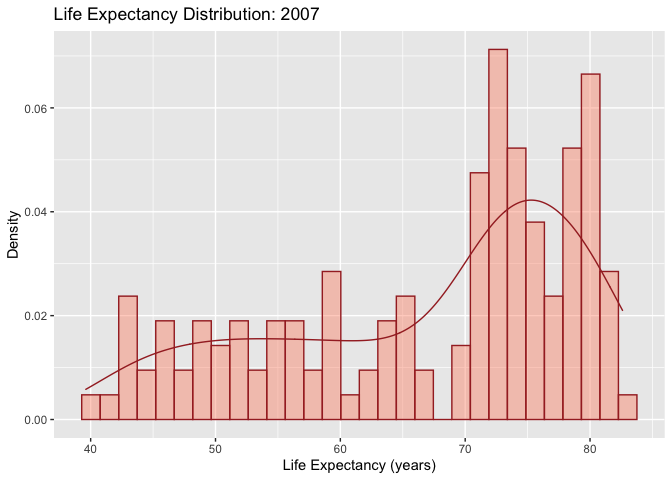
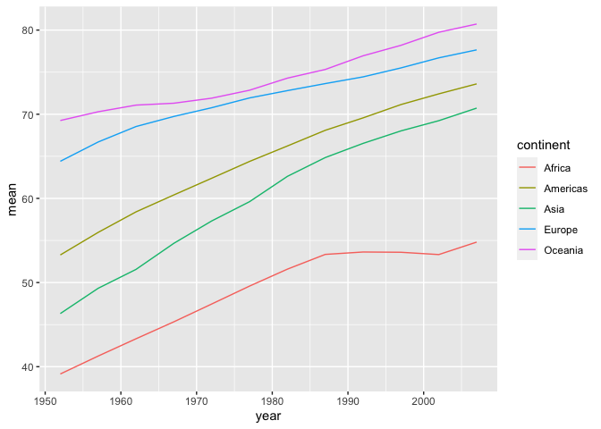
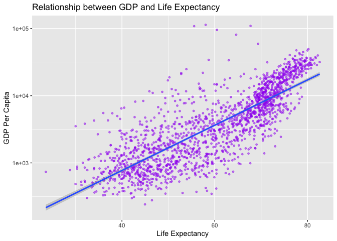
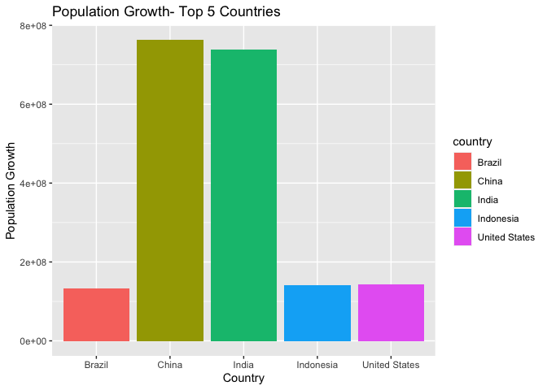
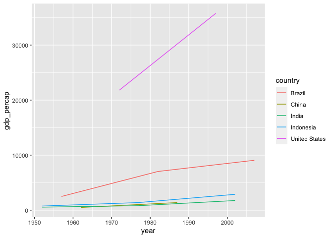
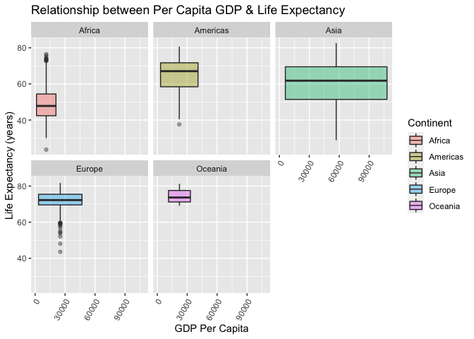

## Instructions
Answer the following questions and complete the exercises in RMarkdown. Please embed all of your code and push your final work to your repository. Your final lab report should be organized, clean, and run free from errors. Remember, you must remove the `#` for the included code chunks to run. Be sure to add your name to the author header above. For any included plots, make sure they are clearly labeled. You are free to use any plot type that you feel best communicates the results of your analysis.  

**In this homework, you should make use of the aesthetics you have learned. It's OK to be flashy!**

Make sure to use the formatting conventions of RMarkdown to make your report neat and clean!  

## Load the libraries

```r
library(tidyverse)
library(janitor)
library(here)
library(naniar)
```

## Resources
The idea for this assignment came from [Rebecca Barter's](http://www.rebeccabarter.com/blog/2017-11-17-ggplot2_tutorial/) ggplot tutorial so if you get stuck this is a good place to have a look.  

## Gapminder
For this assignment, we are going to use the dataset [gapminder](https://cran.r-project.org/web/packages/gapminder/index.html). Gapminder includes information about economics, population, and life expectancy from countries all over the world. You will need to install it before use. This is the same data that we will use for midterm 2 so this is good practice.

```r
#install.packages("gapminder")
library("gapminder")
library(paletteer)
```

## Questions
The questions below are open-ended and have many possible solutions. Your approach should, where appropriate, include numerical summaries and visuals. Be creative; assume you are building an analysis that you would ultimately present to an audience of stakeholders. Feel free to try out different `geoms` if they more clearly present your results.  

**1. Use the function(s) of your choice to get an idea of the overall structure of the data frame, including its dimensions, column names, variable classes, etc. As part of this, determine how NA's are treated in the data.**  

```r
glimpse(gapminder)
```

```
## Rows: 1,704
## Columns: 6
## $ country   <fct> "Afghanistan", "Afghanistan", "Afghanistan", "Afghanistan", …
## $ continent <fct> Asia, Asia, Asia, Asia, Asia, Asia, Asia, Asia, Asia, Asia, …
## $ year      <int> 1952, 1957, 1962, 1967, 1972, 1977, 1982, 1987, 1992, 1997, …
## $ lifeExp   <dbl> 28.801, 30.332, 31.997, 34.020, 36.088, 38.438, 39.854, 40.8…
## $ pop       <int> 8425333, 9240934, 10267083, 11537966, 13079460, 14880372, 12…
## $ gdpPercap <dbl> 779.4453, 820.8530, 853.1007, 836.1971, 739.9811, 786.1134, …
```

```r
naniar::miss_var_summary(gapminder)
```

```
## # A tibble: 6 × 3
##   variable  n_miss pct_miss
##   <chr>      <int>    <dbl>
## 1 country        0        0
## 2 continent      0        0
## 3 year           0        0
## 4 lifeExp        0        0
## 5 pop            0        0
## 6 gdpPercap      0        0
```

**2. Among the interesting variables in gapminder is life expectancy. How has global life expectancy changed between 1952 and 2007?**
## There has been an increase in life expectancy over time.

```r
gapminder <- janitor::clean_names(gapminder)
gapminder
```

```
## # A tibble: 1,704 × 6
##    country     continent  year life_exp      pop gdp_percap
##    <fct>       <fct>     <int>    <dbl>    <int>      <dbl>
##  1 Afghanistan Asia       1952     28.8  8425333       779.
##  2 Afghanistan Asia       1957     30.3  9240934       821.
##  3 Afghanistan Asia       1962     32.0 10267083       853.
##  4 Afghanistan Asia       1967     34.0 11537966       836.
##  5 Afghanistan Asia       1972     36.1 13079460       740.
##  6 Afghanistan Asia       1977     38.4 14880372       786.
##  7 Afghanistan Asia       1982     39.9 12881816       978.
##  8 Afghanistan Asia       1987     40.8 13867957       852.
##  9 Afghanistan Asia       1992     41.7 16317921       649.
## 10 Afghanistan Asia       1997     41.8 22227415       635.
## # … with 1,694 more rows
```


```r
gapminder %>% 
  group_by(year) %>% 
  summarize(mean_life_exp = mean(life_exp))
```

```
## # A tibble: 12 × 2
##     year mean_life_exp
##    <int>         <dbl>
##  1  1952          49.1
##  2  1957          51.5
##  3  1962          53.6
##  4  1967          55.7
##  5  1972          57.6
##  6  1977          59.6
##  7  1982          61.5
##  8  1987          63.2
##  9  1992          64.2
## 10  1997          65.0
## 11  2002          65.7
## 12  2007          67.0
```

```r
my_palette <- paletteer_d("calecopal::gayophytum")
```


```r
library(ggthemes)
```


```r
plot <- gapminder %>% 
  group_by(year) %>% 
  summarize(mean_life_exp=mean(life_exp)) %>% 
  ggplot(aes(x=year, y=mean_life_exp))+ 
  geom_col()+
  labs(title = "Change in Life Expectancy", x = "Year", y = "Mean Life Expectancy")
plot+theme_pander()
```

<!-- -->

**3. How do the distributions of life expectancy compare for the years 1952 and 2007?**

```r
gapminder %>% 
  filter(year == "1952") %>% 
  ggplot(aes(x=life_exp))+
  geom_histogram(aes(y = ..density..), fill = "salmon1", alpha = 0.4, color = "brown")+
  geom_density(color="brown")+
  labs(title = "Life Expectancy Distribution: 1952",
       x = "Life Expectancy (years)", 
       y = "Density")
```

```
## `stat_bin()` using `bins = 30`. Pick better value with `binwidth`.
```

<!-- -->

```r
gapminder %>% 
  filter(year == "2007") %>% 
  ggplot(aes(x=life_exp))+
  geom_histogram(aes(y = ..density..), fill = "salmon1", alpha = 0.4, color = "brown")+
  geom_density(color="brown")+
  labs(title = "Life Expectancy Distribution: 2007",
       x = "Life Expectancy (years)", 
       y = "Density")
```

```
## `stat_bin()` using `bins = 30`. Pick better value with `binwidth`.
```

<!-- -->
**4. Your answer above doesn't tell the whole story since life expectancy varies by region. Make a summary that shows the min, mean, and max life expectancy by continent for all years represented in the data.**

```r
names(gapminder)
```

```
## [1] "country"    "continent"  "year"       "life_exp"   "pop"       
## [6] "gdp_percap"
```


```r
gapminder %>%
  select("continent", "life_exp") %>% 
  group_by(continent) %>% 
  summarize(min_le = min(life_exp),
    max_le=max(life_exp),
    mean_le=mean(life_exp))
```

```
## # A tibble: 5 × 4
##   continent min_le max_le mean_le
##   <fct>      <dbl>  <dbl>   <dbl>
## 1 Africa      23.6   76.4    48.9
## 2 Americas    37.6   80.7    64.7
## 3 Asia        28.8   82.6    60.1
## 4 Europe      43.6   81.8    71.9
## 5 Oceania     69.1   81.2    74.3
```

**5. How has life expectancy changed between 1952-2007 for each continent?**


```r
gapminder %>%
  group_by(year,continent) %>% 
  summarize(mean=mean(life_exp)) %>% 
  ggplot(aes(x=year, y=mean, group=continent, color=continent))+geom_line()
```

```
## `summarise()` has grouped output by 'year'. You can override using the
## `.groups` argument.
```

<!-- -->

**6. We are interested in the relationship between per capita GDP and life expectancy; i.e. does having more money help you live longer?**

```r
gapminder %>% 
  select("gdp_percap", "life_exp") %>% 
   ggplot(aes(x=life_exp, y=gdp_percap)) + geom_point(size=1, color="purple", alpha =0.5)+ scale_y_log10() + geom_smooth(method="lm")+ labs(title = "Relationship between GDP and Life Expectancy", x= "Life Expectancy", y = "GDP Per Capita")
```

```
## `geom_smooth()` using formula 'y ~ x'
```

<!-- -->

**7. Which countries have had the largest population growth since 1952?**
## China, India, the United States, Indonesia, and Brazil have had the largest population growth since 1952.

```r
g_popchange <- gapminder %>% 
  select(country, year, pop) %>% 
  filter(year == "1952" | year == "2007") %>% 
  pivot_wider(names_from = year,
              names_prefix = "yr_",
              values_from = pop) %>% 
  mutate(change_growth = yr_2007-yr_1952) %>% 
  arrange(desc(change_growth))
g_popchange
```

```
## # A tibble: 142 × 4
##    country         yr_1952    yr_2007 change_growth
##    <fct>             <int>      <int>         <int>
##  1 China         556263527 1318683096     762419569
##  2 India         372000000 1110396331     738396331
##  3 United States 157553000  301139947     143586947
##  4 Indonesia      82052000  223547000     141495000
##  5 Brazil         56602560  190010647     133408087
##  6 Pakistan       41346560  169270617     127924057
##  7 Bangladesh     46886859  150448339     103561480
##  8 Nigeria        33119096  135031164     101912068
##  9 Mexico         30144317  108700891      78556574
## 10 Philippines    22438691   91077287      68638596
## # … with 132 more rows
```

**8. Use your results from the question above to plot population growth for the top five countries since 1952.**

```r
g_popchange %>% 
    filter(country == c("China", "India", "United States", "Indonesia", "Brazil")) %>% 
  ggplot(aes(x=country, y=change_growth, fill = country))+ geom_col()+
  labs(title = "Population Growth- Top 5 Countries", x = "Country", y = "Population Growth")
```

```
## Warning in `==.default`(country, c("China", "India", "United States",
## "Indonesia", : longer object length is not a multiple of shorter object length
```

```
## Warning in is.na(e1) | is.na(e2): longer object length is not a multiple of
## shorter object length
```

<!-- -->

```r
names(gapminder)
```

```
## [1] "country"    "continent"  "year"       "life_exp"   "pop"       
## [6] "gdp_percap"
```

**9. How does per-capita GDP growth compare between these same five countries?**

```r
gapminder %>% 
    filter(country == c("China", "India", "United States", "Indonesia", "Brazil")) %>% 
  select(country, gdp_percap)
```

```
## Warning in `==.default`(country, c("China", "India", "United States",
## "Indonesia", : longer object length is not a multiple of shorter object length
```

```
## Warning in is.na(e1) | is.na(e2): longer object length is not a multiple of
## shorter object length
```

```
## # A tibble: 13 × 2
##    country       gdp_percap
##    <fct>              <dbl>
##  1 Brazil             2487.
##  2 Brazil             7031.
##  3 Brazil             9066.
##  4 China               488.
##  5 China              1379.
##  6 India               547.
##  7 India               813.
##  8 India              1747.
##  9 Indonesia           750.
## 10 Indonesia          1383.
## 11 Indonesia          2874.
## 12 United States     21806.
## 13 United States     35767.
```

```r
gapminder %>% 
  filter(country == c("China", "India", "United States", "Indonesia", "Brazil")) %>% 
  select(year, country, gdp_percap) %>% 
  ggplot(aes(x=year, y=gdp_percap, group=country, color=country))+geom_line()
```

```
## Warning in `==.default`(country, c("China", "India", "United States",
## "Indonesia", : longer object length is not a multiple of shorter object length
```

```
## Warning in is.na(e1) | is.na(e2): longer object length is not a multiple of
## shorter object length
```

<!-- -->

**10. Make one plot of your choice that uses faceting!**

```r
gapminder %>% 
  ggplot(aes(x=gdp_percap, y=life_exp, fill=continent))+ 
  geom_boxplot(alpha=0.4) + 
  facet_wrap(~continent, ncol=3)+
  theme(axis.text.x = element_text(angle = 60, hjust = 1))+
  labs(title = "Relationship between Per Capita GDP & Life Expectancy",
       x = "GDP Per Capita",
       y = "Life Expectancy (years)",
       fill = "Continent")
```

<!-- -->

## Push your final code to GitHub!
Please be sure that you check the `keep md` file in the knit preferences. 
