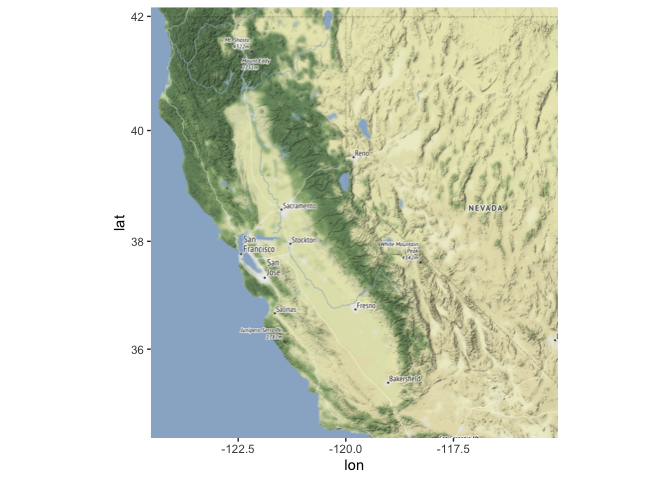
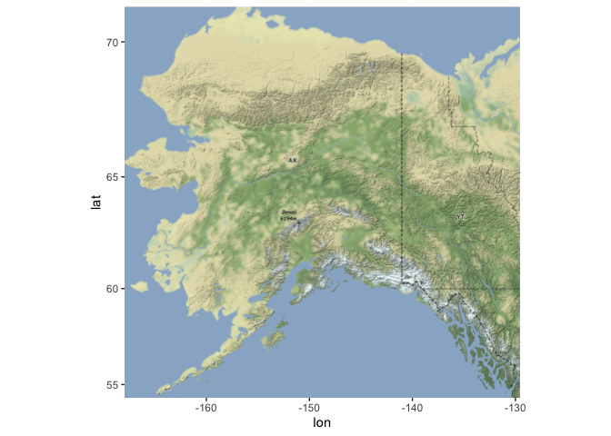
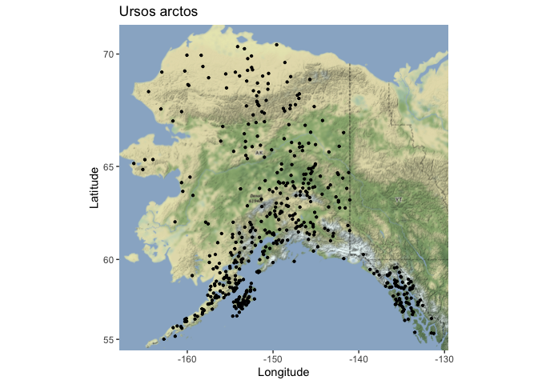

## Learning Goals
*At the end of this exercise, you will be able to:*  
1. Produce distribution maps in R.  
 
## Resources
[Overview of Cooordinate Reference Systems in R](https://www.nceas.ucsb.edu/~frazier/RSpatialGuides/OverviewCoordinateReferenceSystems.pdf)

## Spatial Data in R
There are many packages and techniques for working with spatial data in R. We will cover just some of the basics. One nice package is `ggmap`, which allows us to get base maps from Google Maps, OpenStreetMap, and Stamen Maps. It also works well with `ggplot2`.  

If you completed part 1 of today's lab then you should have the following packages installed. If not, then you should get them going now. You need to do these in order!  

`devtools` and `ggmap`

```r
#install.packages("devtools")
#library(devtools)
#devtools::install_github("dkahle/ggmap")
```

## Load the libraries

```r
library(tidyverse)
```

```
## ── Attaching packages ─────────────────────────────────────── tidyverse 1.3.1 ──
```

```
## ✓ ggplot2 3.3.5     ✓ purrr   0.3.4
## ✓ tibble  3.1.6     ✓ dplyr   1.0.8
## ✓ tidyr   1.2.0     ✓ stringr 1.4.0
## ✓ readr   2.1.2     ✓ forcats 0.5.1
```

```
## ── Conflicts ────────────────────────────────────────── tidyverse_conflicts() ──
## x dplyr::filter() masks stats::filter()
## x dplyr::lag()    masks stats::lag()
```

```r
library(here)
```

```
## here() starts at /Users/ellyn/Desktop/BIS15W2022_eparis
```

```r
library(janitor)
```

```
## 
## Attaching package: 'janitor'
```

```
## The following objects are masked from 'package:stats':
## 
##     chisq.test, fisher.test
```

## Load the `ggmap` package  

```r
library(ggmap)
```

```
## Google's Terms of Service: https://cloud.google.com/maps-platform/terms/.
```

```
## Please cite ggmap if you use it! See citation("ggmap") for details.
```

Let's load our processed data from the first part of the lab.

```r
spiders <- read_csv(here("lab12", "data", "spiders_with_locs.csv")) %>% clean_names()
```

```
## Rows: 270 Columns: 11
## ── Column specification ────────────────────────────────────────────────────────
## Delimiter: ","
## chr  (7): Family, Genus, Country, State, County, Locality, Collector
## dbl  (3): Accession, Latitude, Longitude
## date (1): Date
## 
## ℹ Use `spec()` to retrieve the full column specification for this data.
## ℹ Specify the column types or set `show_col_types = FALSE` to quiet this message.
```

There is an error in one of the coordinates that we will fix here.

```r
spiders <- spiders %>% filter(latitude<=42)
```

## Create Base Map
Our goal here is to plot the spiders locations from the columns which contain the latitude and longitude. First, we need to get a base map for plotting our points on. We could plot them without a base map, but that wouldn't give us any context as to where they are in space. To get a base map we specify a min and max of each x and y coordinate, and create a bounding box.  

We set the bounding box to a little outside our min and max locations with `f = 0.05`.    

`summary()` gives us our min and max.

```r
spiders %>% 
  select(latitude, longitude) %>% 
  summary()
```

```
##     latitude       longitude     
##  Min.   :34.67   Min.   :-124.1  
##  1st Qu.:37.88   1st Qu.:-122.5  
##  Median :38.19   Median :-122.1  
##  Mean   :38.47   Mean   :-121.6  
##  3rd Qu.:38.88   3rd Qu.:-120.5  
##  Max.   :41.80   Max.   :-115.5
```

Now we set the bounding box. We use the min and max values for latitude and longitude to set the range.  

```r
lat <- c(34.67, 41.80)
long <- c(-124.1, -115.5)
bbox <- make_bbox(long, lat, f = 0.05)
```

Let's get a base map for our bounding box area. We will use the stamen maps because they are free. There are several different map types, including: `terrain-labels`, `terrain-lines`, `toner`, `toner-2011`, `toner-background`, `toner-hybrid`, `toner-lines`, `toner-lite`, and `watercolor.`

```r
map1 <- get_map(bbox, maptype = "terrain", source = "stamen")
```

```
## Source : http://tile.stamen.com/terrain/7/19/47.png
```

```
## Source : http://tile.stamen.com/terrain/7/20/47.png
```

```
## Source : http://tile.stamen.com/terrain/7/21/47.png
```

```
## Source : http://tile.stamen.com/terrain/7/22/47.png
```

```
## Source : http://tile.stamen.com/terrain/7/23/47.png
```

```
## Source : http://tile.stamen.com/terrain/7/19/48.png
```

```
## Source : http://tile.stamen.com/terrain/7/20/48.png
```

```
## Source : http://tile.stamen.com/terrain/7/21/48.png
```

```
## Source : http://tile.stamen.com/terrain/7/22/48.png
```

```
## Source : http://tile.stamen.com/terrain/7/23/48.png
```

```
## Source : http://tile.stamen.com/terrain/7/19/49.png
```

```
## Source : http://tile.stamen.com/terrain/7/20/49.png
```

```
## Source : http://tile.stamen.com/terrain/7/21/49.png
```

```
## Source : http://tile.stamen.com/terrain/7/22/49.png
```

```
## Source : http://tile.stamen.com/terrain/7/23/49.png
```

```
## Source : http://tile.stamen.com/terrain/7/19/50.png
```

```
## Source : http://tile.stamen.com/terrain/7/20/50.png
```

```
## Source : http://tile.stamen.com/terrain/7/21/50.png
```

```
## Source : http://tile.stamen.com/terrain/7/22/50.png
```

```
## Source : http://tile.stamen.com/terrain/7/23/50.png
```


```r
ggmap(map1)
```

<!-- -->

## Adding Points to Base Map
`ggmap` works well with `ggplot2`. To add our points we only need to specify the x and y location similar to how we made charts in previous labs. 

```r
ggmap(map1) + 
  geom_point(data = spiders, aes(longitude, latitude)) +
  labs(x= "Longitude", y= "Latitude", title="Spider Locations")
```

<!-- -->

## Practice
Let's practice with a data set that records sightings of grizzly bears (Ursos arctos) in Alaska [data set](https://rcweb.dartmouth.edu/~f002d69/workshops/index_rspatial.html).  

```r
grizzly <- read_csv(here("lab12", "data", "bear-sightings.csv"))
```

```
## Rows: 494 Columns: 3
## ── Column specification ────────────────────────────────────────────────────────
## Delimiter: ","
## dbl (3): bear.id, longitude, latitude
## 
## ℹ Use `spec()` to retrieve the full column specification for this data.
## ℹ Specify the column types or set `show_col_types = FALSE` to quiet this message.
```

1. Use the range of the latitude and longitude to build an appropriate bounding box for your map.

```r
lat <- c(55.02, 70.37)
long <- c(-131.3, -166.2)
bbox <- make_bbox(long, lat, f = 0.05)
```

2. Load a map from `stamen` in a terrain style projection and display the map.

```r
map1 <- get_map(bbox, maptype = "terrain", source = "stamen")
```

```
## Source : http://tile.stamen.com/terrain/5/1/6.png
```

```
## Source : http://tile.stamen.com/terrain/5/2/6.png
```

```
## Source : http://tile.stamen.com/terrain/5/3/6.png
```

```
## Source : http://tile.stamen.com/terrain/5/4/6.png
```

```
## Source : http://tile.stamen.com/terrain/5/1/7.png
```

```
## Source : http://tile.stamen.com/terrain/5/2/7.png
```

```
## Source : http://tile.stamen.com/terrain/5/3/7.png
```

```
## Source : http://tile.stamen.com/terrain/5/4/7.png
```

```
## Source : http://tile.stamen.com/terrain/5/1/8.png
```

```
## Source : http://tile.stamen.com/terrain/5/2/8.png
```

```
## Source : http://tile.stamen.com/terrain/5/3/8.png
```

```
## Source : http://tile.stamen.com/terrain/5/4/8.png
```

```
## Source : http://tile.stamen.com/terrain/5/1/9.png
```

```
## Source : http://tile.stamen.com/terrain/5/2/9.png
```

```
## Source : http://tile.stamen.com/terrain/5/3/9.png
```

```
## Source : http://tile.stamen.com/terrain/5/4/9.png
```

```
## Source : http://tile.stamen.com/terrain/5/1/10.png
```

```
## Source : http://tile.stamen.com/terrain/5/2/10.png
```

```
## Source : http://tile.stamen.com/terrain/5/3/10.png
```

```
## Source : http://tile.stamen.com/terrain/5/4/10.png
```


```r
ggmap(map1)
```

<!-- -->

3. Build a final map that overlays the recorded observations of grizzly bears in Alaska.

```r
ggmap(map1) + 
  geom_point(data = grizzly, aes(longitude, latitude), size=0.8) +
  labs(x = "Longitude", y = "Latitude", title = "Ursos arctos")
```

<!-- -->

## That's it, let's take a break!   

-->[Home](https://jmledford3115.github.io/datascibiol/)
