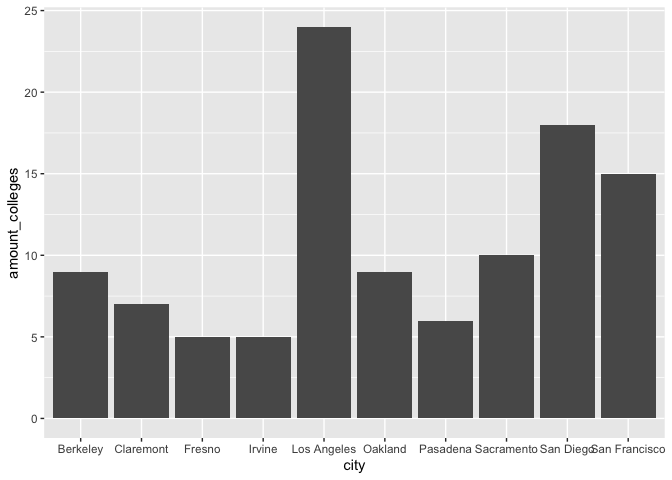
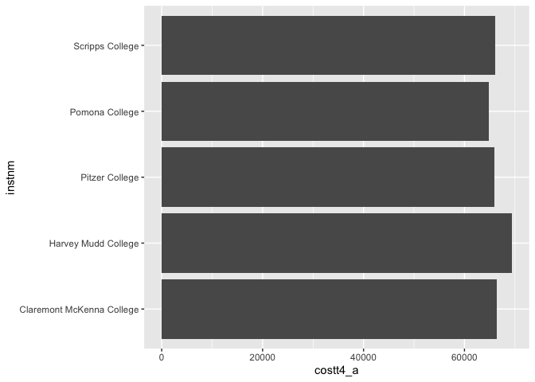
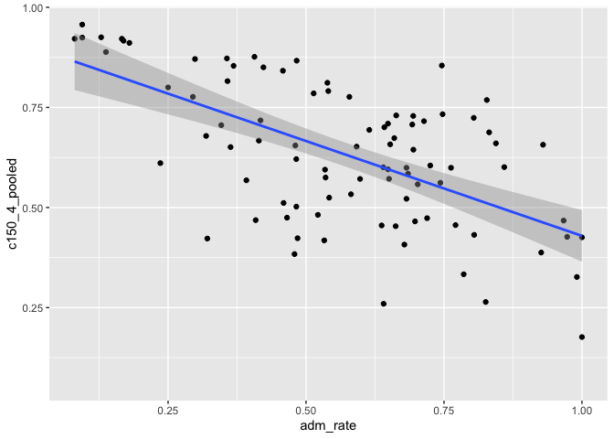
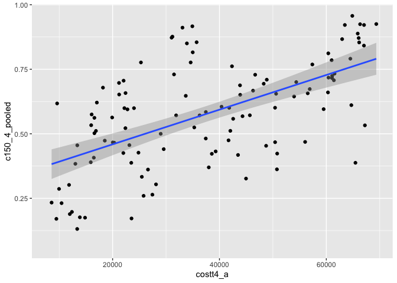
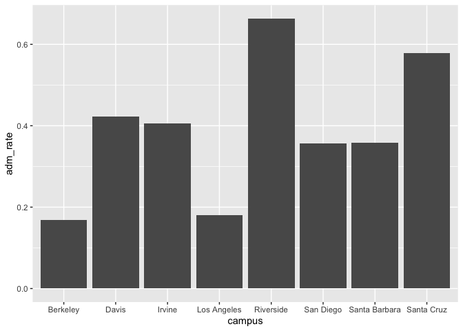
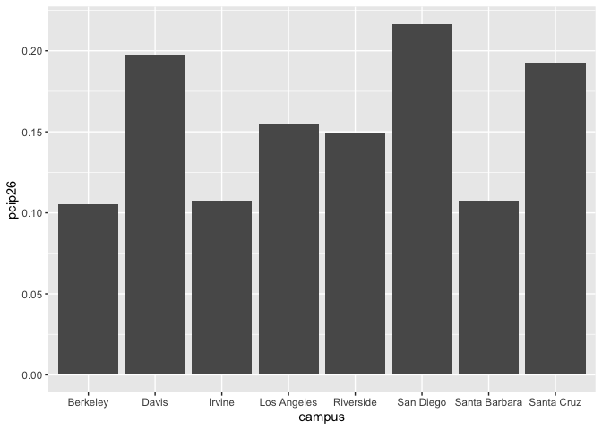

## Instructions
Answer the following questions and complete the exercises in RMarkdown. Please embed all of your code and push your final work to your repository. Your final lab report should be organized, clean, and run free from errors. Remember, you must remove the `#` for the included code chunks to run. Be sure to add your name to the author header above.  

Make sure to use the formatting conventions of RMarkdown to make your report neat and clean!  

## Load the libraries

```r
library(tidyverse)
library(janitor)
library(here)
library(naniar)
```

For this homework, we will take a departure from biological data and use data about California colleges. These data are a subset of the national college scorecard (https://collegescorecard.ed.gov/data/). Load the `ca_college_data.csv` as a new object called `colleges`.

```r
colleges <- readr::read_csv("data/ca_college_data.csv")
```

```
## Rows: 341 Columns: 10
## ── Column specification ────────────────────────────────────────────────────────
## Delimiter: ","
## chr (4): INSTNM, CITY, STABBR, ZIP
## dbl (6): ADM_RATE, SAT_AVG, PCIP26, COSTT4_A, C150_4_POOLED, PFTFTUG1_EF
## 
## ℹ Use `spec()` to retrieve the full column specification for this data.
## ℹ Specify the column types or set `show_col_types = FALSE` to quiet this message.
```

```r
colleges
```

```
## # A tibble: 341 × 10
##    INSTNM      CITY  STABBR ZIP   ADM_RATE SAT_AVG PCIP26 COSTT4_A C150_4_POOLED
##    <chr>       <chr> <chr>  <chr>    <dbl>   <dbl>  <dbl>    <dbl>         <dbl>
##  1 Grossmont … El C… CA     9202…       NA      NA 0.0016     7956        NA    
##  2 College of… Visa… CA     9327…       NA      NA 0.0066     8109        NA    
##  3 College of… San … CA     9440…       NA      NA 0.0038     8278        NA    
##  4 Ventura Co… Vent… CA     9300…       NA      NA 0.0035     8407        NA    
##  5 Oxnard Col… Oxna… CA     9303…       NA      NA 0.0085     8516        NA    
##  6 Moorpark C… Moor… CA     9302…       NA      NA 0.0151     8577        NA    
##  7 Skyline Co… San … CA     9406…       NA      NA 0          8580         0.233
##  8 Glendale C… Glen… CA     9120…       NA      NA 0.002      9181        NA    
##  9 Citrus Col… Glen… CA     9174…       NA      NA 0.0021     9281        NA    
## 10 Fresno Cit… Fres… CA     93741       NA      NA 0.0324     9370        NA    
## # … with 331 more rows, and 1 more variable: PFTFTUG1_EF <dbl>
```

The variables are a bit hard to decipher, here is a key:  

INSTNM: Institution name  
CITY: California city  
STABBR: Location state  
ZIP: Zip code  
ADM_RATE: Admission rate  
SAT_AVG: SAT average score  
PCIP26: Percentage of degrees awarded in Biological And Biomedical Sciences  
COSTT4_A: Annual cost of attendance  
C150_4_POOLED: 4-year completion rate  
PFTFTUG1_EF: Percentage of undergraduate students who are first-time, full-time degree/certificate-seeking undergraduate students  

1. Use your preferred function(s) to have a look at the data and get an idea of its structure. Make sure you summarize NA's and determine whether or not the data are tidy. You may also consider dealing with any naming issues.

```r
colleges <- janitor::clean_names(colleges)
```


```r
names(colleges)
```

```
##  [1] "instnm"        "city"          "stabbr"        "zip"          
##  [5] "adm_rate"      "sat_avg"       "pcip26"        "costt4_a"     
##  [9] "c150_4_pooled" "pftftug1_ef"
```


```r
glimpse(colleges)
```

```
## Rows: 341
## Columns: 10
## $ instnm        <chr> "Grossmont College", "College of the Sequoias", "College…
## $ city          <chr> "El Cajon", "Visalia", "San Mateo", "Ventura", "Oxnard",…
## $ stabbr        <chr> "CA", "CA", "CA", "CA", "CA", "CA", "CA", "CA", "CA", "C…
## $ zip           <chr> "92020-1799", "93277-2214", "94402-3784", "93003-3872", …
## $ adm_rate      <dbl> NA, NA, NA, NA, NA, NA, NA, NA, NA, NA, NA, NA, NA, NA, …
## $ sat_avg       <dbl> NA, NA, NA, NA, NA, NA, NA, NA, NA, NA, NA, NA, NA, NA, …
## $ pcip26        <dbl> 0.0016, 0.0066, 0.0038, 0.0035, 0.0085, 0.0151, 0.0000, …
## $ costt4_a      <dbl> 7956, 8109, 8278, 8407, 8516, 8577, 8580, 9181, 9281, 93…
## $ c150_4_pooled <dbl> NA, NA, NA, NA, NA, NA, 0.2334, NA, NA, NA, NA, 0.1704, …
## $ pftftug1_ef   <dbl> 0.3546, 0.5413, 0.3567, 0.3824, 0.2753, 0.4286, 0.2307, …
```


```r
naniar::miss_var_summary(colleges)
```

```
## # A tibble: 10 × 3
##    variable      n_miss pct_miss
##    <chr>          <int>    <dbl>
##  1 sat_avg          276     80.9
##  2 adm_rate         240     70.4
##  3 c150_4_pooled    221     64.8
##  4 costt4_a         124     36.4
##  5 pftftug1_ef       53     15.5
##  6 pcip26            35     10.3
##  7 instnm             0      0  
##  8 city               0      0  
##  9 stabbr             0      0  
## 10 zip                0      0
```

2. Which cities in California have the highest number of colleges?

```r
colleges %>% 
  group_by(city) %>% summarise(amount_colleges=n_distinct(instnm)) %>% 
  arrange(desc(amount_colleges))
```

```
## # A tibble: 161 × 2
##    city          amount_colleges
##    <chr>                   <int>
##  1 Los Angeles                24
##  2 San Diego                  18
##  3 San Francisco              15
##  4 Sacramento                 10
##  5 Berkeley                    9
##  6 Oakland                     9
##  7 Claremont                   7
##  8 Pasadena                    6
##  9 Fresno                      5
## 10 Irvine                      5
## # … with 151 more rows
```

3. Based on your answer to #2, make a plot that shows the number of colleges in the top 10 cities.

```r
colleges %>% 
  group_by(city) %>% summarise(amount_colleges=n_distinct(instnm)) %>% 
  arrange(desc(amount_colleges)) %>%
  head(10) %>% 
  ggplot(aes(x=city, y=amount_colleges))+
  geom_col()
```

<!-- -->

4. The column `COSTT4_A` is the annual cost of each institution. Which city has the highest average cost? Where is it located?
## Harvey Mudd College has the highest average cost. It is located in Claremont, CA.

```r
colleges %>% 
  select("instnm","city", "costt4_a") %>% 
  arrange(desc(costt4_a))
```

```
## # A tibble: 341 × 3
##    instnm                                        city          costt4_a
##    <chr>                                         <chr>            <dbl>
##  1 Harvey Mudd College                           Claremont        69355
##  2 Southern California Institute of Architecture Los Angeles      67225
##  3 University of Southern California             Los Angeles      67064
##  4 Occidental College                            Los Angeles      67046
##  5 Claremont McKenna College                     Claremont        66325
##  6 Pepperdine University                         Malibu           66152
##  7 Scripps College                               Claremont        66060
##  8 Pitzer College                                Claremont        65880
##  9 San Francisco Art Institute                   San Francisco    65453
## 10 Pomona College                                Claremont        64870
## # … with 331 more rows
```
5. Based on your answer to #4, make a plot that compares the cost of the individual colleges in the most expensive city. Bonus! Add UC Davis here to see how it compares :>).

```r
colleges %>% 
  filter(city == "Claremont") %>%  
  select("instnm", "costt4_a", "city")
```

```
## # A tibble: 7 × 3
##   instnm                        costt4_a city     
##   <chr>                            <dbl> <chr>    
## 1 Pomona College                   64870 Claremont
## 2 Pitzer College                   65880 Claremont
## 3 Scripps College                  66060 Claremont
## 4 Claremont McKenna College        66325 Claremont
## 5 Harvey Mudd College              69355 Claremont
## 6 Claremont Graduate University       NA Claremont
## 7 Claremont School of Theology        NA Claremont
```

```r
college_expensive <- colleges %>% 
  filter(city == "Claremont") %>%
  select("instnm", "costt4_a")
```


```r
college_expensive %>% 
  filter(costt4_a!="NA") %>% 
  ggplot(aes(x=instnm, y=costt4_a))+
  geom_col()+
  coord_flip()
```

<!-- -->

6. The column `ADM_RATE` is the admissions rate by college and `C150_4_POOLED` is the four-year completion rate. Use a scatterplot to show the relationship between these two variables. What do you think this means?
## As admission rate increases, 4-year completion rate drops. This may be due to the fact that colleges with high admission rates do not have the resources (academic, mental health...) that more competitve colleges do, and therefore students are at a disadvantage.

```r
colleges %>% 
    ggplot(aes(x=adm_rate, y=c150_4_pooled))+
  geom_point()+
  geom_smooth(method=lm)
```

```
## `geom_smooth()` using formula 'y ~ x'
```

```
## Warning: Removed 251 rows containing non-finite values (stat_smooth).
```

```
## Warning: Removed 251 rows containing missing values (geom_point).
```

<!-- -->

7. Is there a relationship between cost and four-year completion rate? (You don't need to do the stats, just produce a plot). What do you think this means?
## As the cost increases, the 4-year completion rate also increases. This may be because people who have the priviledge to attend more costly colleges have more resources available to them that help them complete 4 years of school. 

```r
colleges %>% 
    ggplot(aes(x=costt4_a, y=c150_4_pooled))+
  geom_point()+
  geom_smooth(method=lm)
```

```
## `geom_smooth()` using formula 'y ~ x'
```

```
## Warning: Removed 225 rows containing non-finite values (stat_smooth).
```

```
## Warning: Removed 225 rows containing missing values (geom_point).
```

<!-- -->

```r
colleges %>% 
  select(instnm)
```

```
## # A tibble: 341 × 1
##    instnm                    
##    <chr>                     
##  1 Grossmont College         
##  2 College of the Sequoias   
##  3 College of San Mateo      
##  4 Ventura College           
##  5 Oxnard College            
##  6 Moorpark College          
##  7 Skyline College           
##  8 Glendale Community College
##  9 Citrus College            
## 10 Fresno City College       
## # … with 331 more rows
```

8. The column titled `INSTNM` is the institution name. We are only interested in the University of California colleges. Make a new data frame that is restricted to UC institutions. You can remove `Hastings College of Law` and `UC San Francisco` as we are only interested in undergraduate institutions.

```r
uc <- colleges %>% 
  filter(grepl('University of California',instnm))
```

Remove `Hastings College of Law` and `UC San Francisco` and store the final data frame as a new object `univ_calif_final`.

```r
univ_calif_final <- subset(uc, instnm!="University of California-San Francisco" & instnm!="University of California-Hastings College of Law")
univ_calif_final
```

```
## # A tibble: 8 × 10
##   instnm       city  stabbr zip   adm_rate sat_avg pcip26 costt4_a c150_4_pooled
##   <chr>        <chr> <chr>  <chr>    <dbl>   <dbl>  <dbl>    <dbl>         <dbl>
## 1 University … La J… CA     92093    0.357    1324  0.216    31043         0.872
## 2 University … Irvi… CA     92697    0.406    1206  0.107    31198         0.876
## 3 University … Rive… CA     92521    0.663    1078  0.149    31494         0.73 
## 4 University … Los … CA     9009…    0.180    1334  0.155    33078         0.911
## 5 University … Davis CA     9561…    0.423    1218  0.198    33904         0.850
## 6 University … Sant… CA     9506…    0.578    1201  0.193    34608         0.776
## 7 University … Berk… CA     94720    0.169    1422  0.105    34924         0.916
## 8 University … Sant… CA     93106    0.358    1281  0.108    34998         0.816
## # … with 1 more variable: pftftug1_ef <dbl>
```

Use `separate()` to separate institution name into two new columns "UNIV" and "CAMPUS".

```r
univ_calif_final <- univ_calif_final %>% 
  separate(instnm, into = c("univ","campus"), sep = "-")
univ_calif_final
```

```
## # A tibble: 8 × 11
##   univ  campus city  stabbr zip   adm_rate sat_avg pcip26 costt4_a c150_4_pooled
##   <chr> <chr>  <chr> <chr>  <chr>    <dbl>   <dbl>  <dbl>    <dbl>         <dbl>
## 1 Univ… San D… La J… CA     92093    0.357    1324  0.216    31043         0.872
## 2 Univ… Irvine Irvi… CA     92697    0.406    1206  0.107    31198         0.876
## 3 Univ… River… Rive… CA     92521    0.663    1078  0.149    31494         0.73 
## 4 Univ… Los A… Los … CA     9009…    0.180    1334  0.155    33078         0.911
## 5 Univ… Davis  Davis CA     9561…    0.423    1218  0.198    33904         0.850
## 6 Univ… Santa… Sant… CA     9506…    0.578    1201  0.193    34608         0.776
## 7 Univ… Berke… Berk… CA     94720    0.169    1422  0.105    34924         0.916
## 8 Univ… Santa… Sant… CA     93106    0.358    1281  0.108    34998         0.816
## # … with 1 more variable: pftftug1_ef <dbl>
```

9. The column `ADM_RATE` is the admissions rate by campus. Which UC has the lowest and highest admissions rates? Produce a numerical summary and an appropriate plot.
## UC Riverside has the highest admissions rate and UC Berkeley has the lowest.


```r
univ_calif_final %>% 
  filter(adm_rate == max(adm_rate)|adm_rate == min(adm_rate))
```

```
## # A tibble: 2 × 11
##   univ  campus city  stabbr zip   adm_rate sat_avg pcip26 costt4_a c150_4_pooled
##   <chr> <chr>  <chr> <chr>  <chr>    <dbl>   <dbl>  <dbl>    <dbl>         <dbl>
## 1 Univ… River… Rive… CA     92521    0.663    1078  0.149    31494         0.73 
## 2 Univ… Berke… Berk… CA     94720    0.169    1422  0.105    34924         0.916
## # … with 1 more variable: pftftug1_ef <dbl>
```

```r
univ_calif_final %>% 
  ggplot(aes(x=campus, y=adm_rate))+
  geom_col()
```

<!-- -->

10. If you wanted to get a degree in biological or biomedical sciences, which campus confers the majority of these degrees? Produce a numerical summary and an appropriate plot.
## UCSD provides the greatest amount of biomedical sciences degrees.

```r
univ_calif_final %>% 
  filter(pcip26==max(pcip26))
```

```
## # A tibble: 1 × 11
##   univ  campus city  stabbr zip   adm_rate sat_avg pcip26 costt4_a c150_4_pooled
##   <chr> <chr>  <chr> <chr>  <chr>    <dbl>   <dbl>  <dbl>    <dbl>         <dbl>
## 1 Univ… San D… La J… CA     92093    0.357    1324  0.216    31043         0.872
## # … with 1 more variable: pftftug1_ef <dbl>
```


```r
univ_calif_final %>% 
  ggplot(aes(x=campus,y=pcip26))+
  geom_col()
```

<!-- -->

## Knit Your Output and Post to [GitHub](https://github.com/FRS417-DataScienceBiologists)
